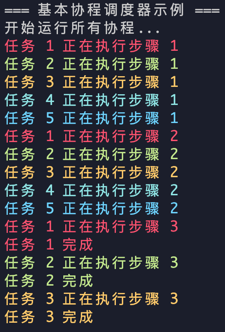
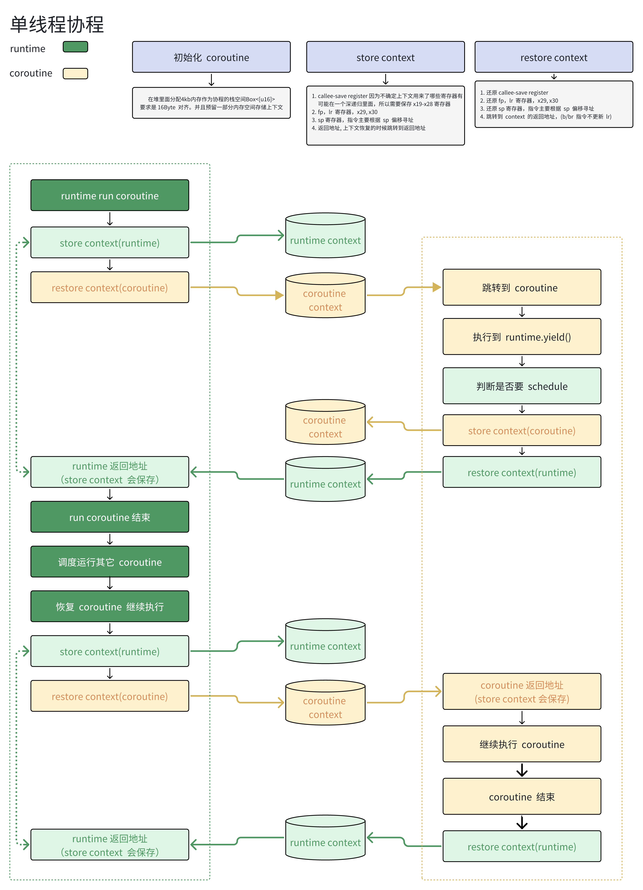

# 单线程协程

示例

```rust

let runtime = Runtime::new();

// 创建多个协程任务，每个任务会执行多次并主动让出控制权
for task_id in 1..=5 {
    runtime.spawn({
        let runtime = runtime.clone();
        move || {
            for step in 1..=3 {
                println!("任务 {} 正在执行步骤 {}", task_id, step);
                if step < 3 {
                    // 主动让出控制权，让其他协程有机会执行
                    runtime.schedule();
                }
            }
            println!("任务 {} 完成", task_id);
        }
    });
}

println!("开始运行所有协程...");
runtime.wait();
println!("所有协程执行完成!");
```




## 仅用于学习目的

使用 arm64 汇编，没考虑其它平台

[zhihu 详解文章](https://zhuanlan.zhihu.com/p/1916632808568383306)

