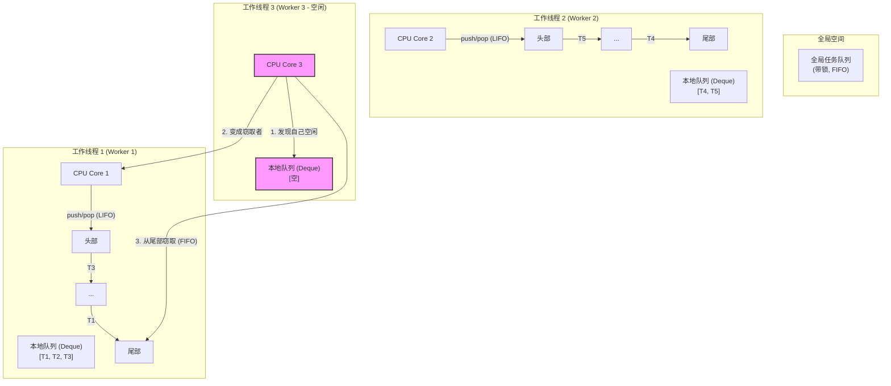

# 文档：工作窃取调度器原理解析

## 1. 为什么需要工作窃取？—— 问题的根源

在我们之前的讨论中，我们通过一个全局的 `Mutex` 解决了多线程的数据竞争问题。但这引入了新的瓶颈：**锁竞争（Lock Contention）**。

想象一个场景：我们有 8 个 CPU 核心，所以我们创建了 8 个工作线程。所有这 8 个线程在寻找下一个要执行的协程时，都必须去竞争同一个全局的 `Mutex`。

```
Thread 1: lock() -> get task -> unlock()
Thread 2: waits...
Thread 3: waits...
Thread 4: waits...
...
```

当线程数量增多，任务切换频繁时，这个全局锁就会成为性能的"独木桥"，系统的大部分时间都将耗费在线程的等待和唤醒上，而不是真正地执行任务。并发的优势荡然无存。

**工作窃取的核心思想就是：最大化地减少或消除这种全局锁竞争。**

## 2. 工作窃取调度器的核心组件

工作窃取调度器通过一种"分而治之"的策略来解决这个问题。它的架构主要包含以下几个部分：

- **工作线程 (Worker Threads)**：通常会创建与 CPU 核心数相等的操作系统线程。每个线程都是一个独立的执行单元。
- **本地工作队列 (Local Work Queue)**：**这是最重要的设计**。每个工作线程都拥有一个自己的、私有的任务队列。这个队列通常是一个**双端队列 (Deque)**。
- **全局任务队列 (Global Task Queue)**：一个可选的、带锁的全局队列。它用于接收那些从外部（非工作线程）提交的任务。
- **窃取者 (Thieves/Stealers)**：当一个工作线程完成了自己本地队列中的所有任务后，它就会变成一个"窃"取者"，去"偷"其他线程的任务。

## 3. "后进先出 (LIFO)" vs "先进先出 (FIFO)" 的精妙设计

这是工作窃取调度器性能的关键。对于本地队列的操作，遵循以下两个原则：

1.  **对于工作线程自己**：它将自己的本地队列当作一个**栈 (Stack)**来使用。当它产生一个新任务（比如 `spawn` 一个子协程）或一个任务被暂停（`schedule`）时，它会把任务 `push`到自己队列的**头部**。当它需要获取新任务时，它会从队列的**头部** `pop` 一个任务。这是一种 **LIFO (Last-In, First-Out)** 的行为。

    - **优势**：LIFO 行为非常有利于 CPU 缓存。刚刚被暂停的任务和它所操作的数据很可能还保留在 CPU 的 L1/L2 缓存中，立刻恢复它会非常快。

2.  **对于窃取者线程**：当一个线程要去偷窃时，它会从另一个线程本地队列的**尾部** `steal` 一个任务。这是一种 **FIFO (First-In, First-Out)** 的行为。
    - **优势**：通过让所有者在"一端"（头部）操作，让窃取者在"另一端"（尾部）操作，极大地**降低了两个线程在同一个队列上发生冲突的概率**。这使得本地队列在大部分时间下可以做到**无锁**或使用开销极低的原子操作。

## 4. 整体工作流程

一个简化的图示如下：



## 5. 详细工作步骤

一个工作线程的生命周期大致如下：

1.  **寻找任务**：线程首先查看自己的本地队列（从头部 `pop`）。
2.  **有本地任务？**
    - **是**：执行任务。如果任务执行中 `spawn` 了新的子任务，将子任务 `push` 到自己本地队列的头部。如果任务被 `schedule`（暂停），也放回本地队列头部。然后回到步骤 1。
    - **否**：本地队列为空，线程需要找点事做。
3.  **开始窃取**：线程会随机选择一个"受害者"线程。
4.  **尝试从受害者窃取**：它会尝试从受害者本地队列的**尾部**偷一个任务。
    - **成功**：太好了！现在它有任务了。执行这个偷来的任务。回到步骤 2。
    - **失败**：受害者的队列也是空的，或者在它偷的瞬间，受害者自己把最后一个任务拿走了。
5.  **更换目标继续偷**：如果窃取失败，线程会选择下一个受害者，重复步骤 3-4。
6.  **都偷不到？**：如果尝试了所有其他线程，都偷不到任务，这时它可能会去检查**全局任务队列**。
    - **全局队列有任务**：从全局队列取一批任务，放到自己的本地队列中。回到步骤 1。
    - **全局队列也空了**：真的没事干了。线程可能会进入休眠状态，等待新的任务通过全局队列被提交时再被唤醒。

---

# 改造方案：将您的项目升级为工作窃取模型

现在，让我们把理论应用到实践中。要改造您当前的项目，需要进行一系列结构性的重构。

## 阶段一：定义新的数据结构

首先，我们需要定义工作窃取模型的核心组件。我建议创建一个新的 `worker.rs` 文件来组织这些逻辑。

#### 1. `Worker` 和 `LocalQueue`

每个 `Worker` 代表一个工作线程。它需要拥有自己的本地任务队列。为了实现无锁或低锁的本地队列，我们可以使用像 `crossbeam-deque` 这样的库，它提供了专门为工作窃取设计的无锁双端队列。

**`Cargo.toml`**

```toml
[dependencies]
crossbeam-deque = "0.8"
# ... 其他依赖
```

**`src/worker.rs` (新文件)**

```rust
use crate::coroutine::Coroutine;
use crossbeam_deque::{Injector, Stealer, Worker as DequeWorker};
use std::thread;

// 每个工作线程的本地上下文
pub struct Worker {
    thread_id: usize,
    // DequeWorker 是 crossbeam 提供的本地队列的"所有者"端
    local_queue: DequeWorker<Coroutine>,
    // Stealer 是窃取端，需要分发给其他 Worker
    stealer: Stealer<Coroutine>,
}

impl Worker {
    pub fn new(thread_id: usize) -> Self {
        let local_queue = DequeWorker::new_fifo();
        let stealer = local_queue.stealer();
        Self { thread_id, local_queue, stealer }
    }

    // 在自己的本地队列上推入/弹出任务
    pub fn push(&self, task: Coroutine) {
        self.local_queue.push(task);
    }

    pub fn pop(&self) -> Option<Coroutine> {
        self.local_queue.pop()
    }

    // 获取用于窃取的 Stealer
    pub fn stealer(&self) -> &Stealer<Coroutine> {
        &self.stealer
    }
}
```

#### 2. 全新的 `Runtime`

`Runtime` 的角色将从"任务的直接管理者"转变为"工作线程和全局队列的协调者"。

**`src/runtime.rs` (重构)**

```rust
use crate::coroutine::Coroutine;
use crate::worker::Worker;
use crossbeam_deque::Injector;
use std::sync::Arc;
use std::thread;

pub struct Runtime {
    // 全局任务注入器
    global_queue: Arc<Injector<Coroutine>>,
    // 持有所有工作线程的 stealer，以便窃取
    stealers: Vec<Arc<crossbeam_deque::Stealer<Coroutine>>>,
    // 工作线程的句柄
    handles: Vec<thread::JoinHandle<()>>,
}

impl Runtime {
    pub fn new(num_threads: usize) -> Self {
        let global_queue = Arc::new(Injector::new());
        let mut workers = Vec::with_capacity(num_threads);
        let mut stealers = Vec::with_capacity(num_threads);

        for id in 0..num_threads {
            let worker = Worker::new(id);
            stealers.push(Arc::new(worker.stealer().clone())); // Stealer可以被clone
            workers.push(worker);
        }

        let mut handles = Vec::with_capacity(num_threads);

        // 创建工作线程
        for worker in workers {
            let global_queue_clone = global_queue.clone();
            let stealers_clone = stealers.clone();

            let handle = thread::spawn(move || {
                // 这里是每个线程的运行循环
                worker_loop(worker, global_queue_clone, stealers_clone);
            });
            handles.push(handle);
        }

        Self { global_queue, stealers, handles }
    }

    // 从外部提交任务
    pub fn spawn<F: TaskFn>(&self, task: F) {
        // ... 创建 Coroutine ...
        // let coroutine = Coroutine::new(...);
        // 新任务被推送到全局队列
        // self.global_queue.push(coroutine);
    }

    // 等待所有线程结束
    pub fn wait(self) {
        for handle in self.handles {
            handle.join().unwrap();
        }
    }
}

// 工作线程的主循环逻辑
fn worker_loop(
    worker: Worker,
    global_queue: Arc<Injector<Coroutine>>,
    stealers: Vec<Arc<crossbeam_deque::Stealer<Coroutine>>>,
) {
    loop {
        // 1. 先从本地队列找任务
        if let Some(task) = worker.pop() {
            // run_task(task);
            continue;
        }

        // 2. 尝试从全局队列获取一批任务
        // ...

        // 3. 尝试从其他线程窃取
        // ...
    }
}
```

## 阶段二：修改协程和上下文切换

您的 `Coroutine` 和上下文切换逻辑非常棒，几乎不需要大改。主要需要确保 `Coroutine` 可以在线程间安全地传递。

**`src/coroutine.rs`**

```rust
// ...

// Coroutine 结构体需要能够跨线程发送
unsafe impl Send for Coroutine {}
unsafe impl Sync for Coroutine {}

// CoroutineContext 也一样
unsafe impl Send for CoroutineContext {}
unsafe impl Sync for CoroutineContext {}

// ...
```

这里的 `unsafe` 是一个承诺，我们向编译器保证：虽然 `Coroutine` 内部有裸指针 (`*mut CoroutineContext`)，但我们设计的调度器会确保在恢复协程时，它一定是在某个工作线程的上下文中，并且不会产生数据竞争。我们的工作窃取设计保证了这一点，因为一个协程在任何时候只可能被一个线程执行。

## 阶段三：实现 `worker_loop`

这是最核心的调度逻辑。

```rust
// in worker_loop

// 寻找任务的函数
fn find_task(...) -> Option<Coroutine> {
    // 1. 优先本地
    worker.pop().or_else(|| {
        // 2. 检查全局队列
        global_queue.steal_batch_and_pop(&worker.local_queue).or_else(|| {
            // 3. 轮流窃取
            std::iter::repeat_with(|| {
                // 随机选择一个受害者
                let victim_stealer = &stealers[rand::thread_rng().gen_range(0..stealers.len())];
                victim_stealer.steal()
            })
            .find(|s| s.is_success())
            .and_then(|s| s.success())
        })
    })
}

loop {
    if let Some(mut task) = find_task(...) {
        // 这里需要重新设计，因为 schedule 逻辑变了
        task.resume();
    } else {
        // 真正空闲，可以休眠等待
        thread::park();
    }
}
```

## 挑战：`schedule` 的实现

在单线程模型中，`schedule` 意味着"把控制权还给唯一的调度器"。在多线程模型中，它意味着"我这个任务暂停一下，把我放回**我当前所在线程**的**本地队列**，让这个线程去干点别的"。

这就需要协程在执行时能知道自己当前在哪个 `Worker` 上下文中。这可以通过线程本地存储（`thread_local!`）来实现。

**`src/worker.rs`**

```rust
use std::cell::RefCell;

// 使用线程本地存储来存放当前 Worker 的本地队列的引用
thread_local! {
    // 使用 RefCell 是因为我们可能需要在运行时修改它
    static CURRENT_WORKER_QUEUE: RefCell<Option<DequeWorker<Coroutine>>> = RefCell::new(None);
}
```

然后修改 `schedule` 函数，让它把当前协程放回当前线程的本地队列。

## 总结与下一步

将您的项目重构为工作窃取模型是一个激动人心的飞跃。这会让您的调度器从一个"玩具"项目变成一个拥有现代、高性能架构的"准工业级"项目。

**您的改造路线图：**

1.  **引入 `crossbeam-deque`**：这是实现高效本地队列的基础。
2.  **创建 `worker.rs`**：定义 `Worker` 结构体和线程本地变量。
3.  **重构 `Runtime`**：将其角色转变为线程和全局队列的协调者。
4.  **实现 `worker_loop`**：编写核心的 "LIFO/FIFO" 调度和窃取逻辑。
5.  **改造 `schedule`**：使用线程本地存储，让协程能把自己放回正确的本地队列。
6.  **标记 `Send + Sync`**：向编译器做出安全承诺。

这个过程很有挑战，但每一步都会加深您对现代并发编程核心原理的理解。
